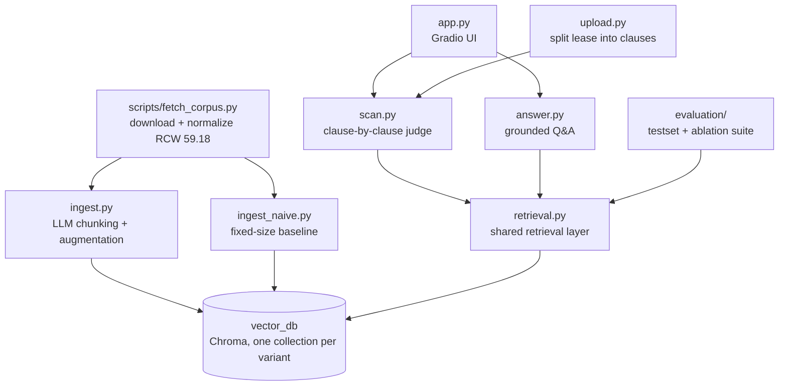

# LeaseHound 🐕

**Upload your lease. LeaseHound sniffs out the clauses that shouldn't be there.** A two-layer RAG system that answers tenant-law questions and scans rental agreements for prohibited provisions — grounded in Washington State's Residential Landlord-Tenant Act (RCW 59.18).

> ⚖️ LeaseHound is an educational tool, not legal advice.

## Why this exists

Residential leases routinely contain clauses that are void and unenforceable under state law — Washington's RCW 59.18.230 alone prohibits ten kinds of provisions (rights waivers, landlord attorney-fee clauses, exculpation clauses, late fees inside the 5-day grace period, mandatory NDAs on rent terms, …), and a landlord who knowingly includes them is exposed to statutory damages of up to 2× monthly rent. Most tenants sign without knowing any of this.

**Why not just paste your lease into ChatGPT?** The lease fits in a context window; the law shouldn't come from parametric memory. Statutes change (RCW 59.18.230 was amended in 2025), models mix up states and invent citation numbers, and a chat answer can't be verified. LeaseHound retrieves the current statute text and cites the exact section — every claim has a clickable source.

## Architecture

Two corpus layers, two query modes:

| | Layer 1: Reference corpus | Layer 2: Your document |
| --- | --- | --- |
| Content | State statutes + official guidance | The lease you upload |
| Processing | Offline ingestion, evaluated with an ablation suite | Split into clauses on the fly (deterministic, no LLM) |

- **Scan mode** — walks your lease clause by clause, retrieves the governing statute for each, and produces a structured red-flag report with citations. Clause judgments are independent API calls, so they run concurrently — a 15-clause lease scans in ~10 seconds instead of ~90. A second, negative-space pass checks a hand-curated, statute-cited checklist of required protections and reports what the lease *fails to include* (the LLM only judges presence — it never invents requirements). A document sanity check refuses non-leases before any clause is judged
- **Ask mode** — RAG Q&A over the statute corpus ("Can my landlord charge a late fee on day 3?"); once you've scanned a lease, the report joins the chat context so answers are about *your* lease. A session-scoped vector collection for full lease-text retrieval is planned.

Retrieval pipeline: LLM-driven semantic chunking & augmentation (Pydantic structured outputs, parallel ingestion with validation + retry) → query router (greetings and small talk skip retrieval entirely) → dual-query retrieval (original + rewritten) merged with reciprocal rank fusion → self-grading retrieval (CRAG-style) → LLM reranking → grounded generation with source citations.

### Code map



Top half runs offline (build the statute library); bottom half is runtime. Both query modes and the evaluation suite sit on the same `retrieval.py`, so an ablation result measures exactly the code the product runs.

## Setup

```bash
pip install -e .
echo "OPENAI_API_KEY=sk-..." > .env
python scripts/fetch_corpus.py     # fetch RCW 59.18 → corpus/wa/statutes/ (98 sections)
python -m leasehound.ingest        # chunk + embed → vector_db/ (one-time, a few cents)
```

## Try it — scan a lease

```bash
python -m leasehound.scan examples/sample_lease.md   # CLI
python -m leasehound.app                             # web UI at localhost:7860
```

The web UI is a single chat with an artifact-style side panel: attach a lease (or one-click the sample) to scan it, or just type to ask questions — scan progress streams into the chat clause by clause, and the finished red-flag report pins to the panel so it stays visible while you ask follow-ups — answered token-by-token with the report in context and statute citations.

`examples/sample_lease.md` is a synthetic lease with **seven deliberately planted violations** (late fees inside the grace period, landlord attorney-fee clause, no-notice entry, rent NDA, rights waiver, electronic-payment-only, exculpation) — it doubles as the scanner's acceptance test. Current result: **7/7 planted violations flagged red with statute citations, zero false reds** among the ordinary clauses; the security-deposit clause comes back yellow (fact-dependent), which is the intended behavior. See `examples/README.md` for the expected-flags table and `examples/scan_report.md` for the full output.

## Privacy

A lease is sensitive: names, address, rent. LeaseHound keeps handling minimal —

- Uploads are parsed in memory; the uploaded temp file is deleted immediately after parsing, and lease text never enters the vector store.
- Clause text is sent to the OpenAI API for embedding and analysis. OpenAI does not train on API data (retained ~30 days for abuse monitoring), but treat it as a third-party disclosure: don't upload a document you couldn't share — or use the sample lease.
- Local PII redaction before the API call (regex + local NER — it can't be done by the same cloud LLM you're redacting *from*) is a considered follow-up.
- Prefer fully local inference? All LLM calls route through litellm: set `LEASEHOUND_UTILITY_MODEL` / `LEASEHOUND_GENERATION_MODEL` to e.g. `ollama/llama3.1` (expect weaker verdicts from small local models; embeddings still require an OpenAI key).

## Corpus status

- ✅ `corpus/wa/statutes/` — RCW Chapter 59.18, all 98 sections (public domain, includes 2025 amendments), fetched and normalized by `scripts/fetch_corpus.py`
- ⬜ `corpus/wa/guides/` — WA Attorney General landlord-tenant guidance (planned)
- ⬜ Seattle municipal layer (planned)
- States are first-class metadata: each state is an independent collection; CA are planned follow-ups.

## Evaluation

Retrieval quality is measured on a 43-question test set of colloquial tenant questions, each generated from — and then verified against — a known statute section, so the ground truth holds by construction (an LLM verification pass dropped 7 contaminated questions). Generation-layer evaluation (LLM-as-judge) is next.

### Ablation — section-level retrieval, n=43

| pipeline configuration | MRR | nDCG | hit@5 | hit@10 |
| --- | --- | --- | --- | --- |
| naive fixed-size chunks (baseline) | .817 | .862 | .953 | **1.000** |
| LLM semantic chunking | .775 | .813 | .884 | .930 |
| + plain-language augmentation | .799 | .842 | .930 | .977 |
| + dual-query retrieval (RRF merge) | .797 | .840 | .907 | .977 |
| + LLM rerank | .794 | .833 | .907 | .953 |
| + CRAG self-grading (full pipeline) | **.827** | **.869** | .930 | **1.000** |

### What the ablation taught us

1. **Naive chunking is a brutally strong baseline** for section-level retrieval: statute sections are already coherent topical units, and long fixed-size chunks carry more section-distinctive vocabulary than fine-grained semantic chunks. Fancy ≠ better; measure before you pay.
2. **Plain-language augmentation earns its keep** (+.024 MRR over plain LLM chunks): renter-vocabulary summaries bridge colloquial queries to statutory language — though they don't fully recover the chunking loss on this metric.
3. **The ablation caught a silent no-op.** With append-style merging and no reranker downstream, dual-query retrieval could never change top-k — by construction. Fixed with reciprocal rank fusion: ten lines of deterministic code, zero extra LLM calls.
4. **CRAG self-grading is the one stage with a clear individual win** (+.033 MRR over the rerank row, restoring hit@10 to 1.000): re-querying with statutory vocabulary rescues exactly the questions the other stages miss.
5. **Honest caveat:** at n=43, one flipped question ≈ .023 MRR, so most gaps are within noise — the full pipeline and the naive baseline are statistically tied here. The augmented chunks' real payoff (generation quality, provision-level precision for scan mode) is measured at the next layer, not this one.

## Roadmap

- Generation-layer evaluation (LLM-as-judge) on top of the retrieval ablation
- OCR for scanned/photo leases (Tesseract) — today a no-text-layer PDF is detected and refused with an explanation
- Session-scoped vector collection for full lease-text retrieval in ask mode
- Fairness grade for the whole lease — derived mechanically from verdict counts, never model-invented
- CA corpus (states are first-class metadata already)
