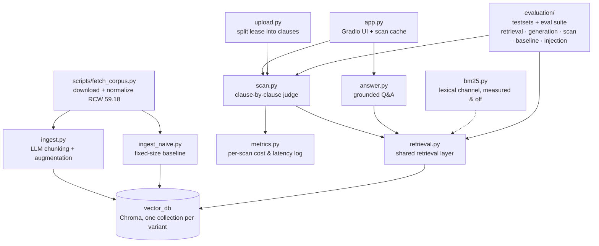

# LeaseHound 🐕

**Upload your lease. LeaseHound sniffs out the clauses that shouldn't be there.** A two-layer RAG system that answers tenant-law questions and scans rental agreements for prohibited provisions — grounded in Washington State's Residential Landlord-Tenant Act (RCW 59.18).

**🐕 [Live demo](https://leasehound-671004460975.us-west1.run.app)** — one click scans the sample lease, warm and answering in ~80 ms ([how that stays free](#try-it)).


> ⚖️ LeaseHound is an educational tool, not legal advice. Verdicts are judged against a snapshot of RCW 59.18 fetched 2026-07-25 — the law may have changed since.

## Why this exists

Residential leases routinely contain clauses that are void and unenforceable under state law — Washington's RCW 59.18.230 alone prohibits ten kinds of provisions (rights waivers, landlord attorney-fee clauses, exculpation clauses, late fees inside the 5-day grace period, mandatory NDAs on rent terms, …), and a landlord who knowingly includes them is exposed to statutory damages of up to 2× monthly rent. Most tenants sign without knowing any of this.

**Why not just paste your lease into ChatGPT?** The lease fits in a context window; the law shouldn't come from parametric memory. Statutes change (RCW 59.18.230 was amended in 2025), models mix up states and invent citation numbers, and a chat answer can't be verified. LeaseHound retrieves the current statute text and cites the exact section — every claim has a clickable source. This claim is measured, not asserted (see the [zero-shot baseline](evaluation/README.md#zero-shot-baseline--the-same-leases-without-the-pipeline)).

**Results at a glance** — every number comes from the [evaluation suite](#evaluation) below:

| | measured result |
| --- | --- |
| 6 hand-labeled leases · 18 planted violations | **18/18 flagged red · 0 false reds · 18/18 citations correct** · 6/6 missing-protection sets |
| the same leases, same model, zero-shot | 14/18 flagged · **3/14 citations correct** · 0/6 protection sets |
| 40 generated leases · 61 planted violations | 60/61 flagged red · 60/60 cited correctly · [precision is an audited lower bound](evaluation/README.md#scaling-past-the-ceiling--40-generated-leases-labels-for-free) |
| 5 prompt-injection payloads inside hostile leases | **5/5 held** — every planted violation still red, no scan suppressed, and 5/5 clean on the report → ask-mode carryover path |
| scan-mode retrieval, 79 labelled clauses | governing section arrives 79/79 — [all 40 partial misses were one section, and fixing it cost precision](evaluation/README.md#scan-mode-retrieval--one-miss-and-three-fixes-that-did-not-ship) |
| cost & latency, 120 logged scans (9–15 clauses) | ≈ $0.0112/scan · p50 8.7 s · [p95 21.8 s is the provider, not the pipeline](#what-a-scan-costs) · [a real 49-clause lease costs $0.061 / 18.5 s](#what-a-scan-costs) |
| ask mode, per question | $0.0029 · median 6.5 s — [1.8× the cost of the two-stage pipeline it beat by 1–2 questions](#what-the-extra-stages-cost) |

## Architecture

Two corpus layers, two query modes:

| | Layer 1: Reference corpus | Layer 2: Your document |
| --- | --- | --- |
| Content | State statutes + official guidance | The lease you upload |
| Processing | Offline ingestion, evaluated with an ablation suite | Split into clauses on the fly (deterministic, no LLM) |

- **Scan mode** — walks your lease clause by clause, retrieves the governing statute for each, and produces a structured red-flag report with citations. Each clause queries the statutes directly, skipping the query-rewriting stages: those bridge renter vocabulary to statute vocabulary (see the adversarial experiment below), and a lease clause already speaks statute — a hybrid lexical channel was [measured here and rejected](evaluation/README.md#hybrid-retrieval-bm25--dense--measured-and-not-shipped) too. Clause judgments are independent API calls, so they run concurrently — a 15-clause lease scans in ~10 seconds instead of ~90. A second, negative-space pass checks a hand-curated, statute-cited checklist of required protections and reports what the lease *fails to include* (the LLM only judges presence — it never invents requirements); because "this lease omits X" is a claim about the whole document, that pass reads the document in 24k windows and merges them, rather than reading the first 24k and inferring the rest. A document sanity check flags non-leases before any clause is judged — advisory rather than fatal, since a wrong reject used to cost the visitor everything. Scans judge at most 60 clauses to bound what one upload can spend; past that the scan is [partial and says so](#when-a-lease-is-longer-than-the-cap) rather than refused, because [real WA housing agreements run to 270 clauses](evaluation/README.md#document-formats--real-published-leases-and-real-numbering)
- **Ask mode** — RAG Q&A over the statute corpus ("Can my landlord charge a late fee on day 3?"); once you've scanned a lease, the report joins the chat context so answers are about *your* lease. A session-scoped vector collection for full lease-text retrieval is planned.

Retrieval pipeline: LLM-driven semantic chunking & augmentation (Pydantic structured outputs, parallel ingestion with validation + retry) → query router (greetings and small talk skip retrieval entirely) → dual-query retrieval (original + rewritten) merged with reciprocal rank fusion → self-grading retrieval (CRAG-style) → LLM reranking → grounded generation with source citations.

### Code map



Top half runs offline (build the statute library); bottom half is runtime. Both query modes and the evaluation suite sit on the same `retrieval.py`, so an ablation result measures exactly the code the product runs.

## Setup

```bash
pip install -e .
echo "OPENAI_API_KEY=sk-..." > .env
python scripts/fetch_corpus.py     # fetch RCW 59.18 → corpus/wa/statutes/ (98 sections)
python -m leasehound.ingest        # chunk + embed → vector_db/ (one-time, a few cents)
```

## Try it

```bash
python -m leasehound.scan examples/sample_lease.md   # CLI
python -m leasehound.app                             # web UI at localhost:7860
```

The web UI is a single chat with an artifact-style side panel: attach a lease (or one-click the sample) to scan it, or just type to ask questions. Scan progress streams into the chat clause by clause, and the finished red-flag report pins to the panel so it stays visible while you ask follow-ups — answered token-by-token with the report in context and statute citations.


No setup at all: the **[hosted demo](https://leasehound-671004460975.us-west1.run.app)** runs the same code on Cloud Run — the `Dockerfile` bakes the vector store into the image, so the container is stateless and scales to zero between visitors. Cold starts are the cost of that, a bad first impression for the one visitor who matters, so a Cloud Monitoring uptime check probes every five minutes: it keeps an instance warm, alerts me on failure, and stays inside the free tier at 288 requests/day — `min-instances=1` would have solved the same problem for about $15/month.

<a id="what-the-image-ships"></a>**What the image actually ships**, since the cold start is what visitors feel. The container is **868 MB**, of which the vector store is **9.8 MB** — so the store was never the interesting number, and this README used to imply otherwise by listing "a 42 MB vector store" beside Chroma and Gradio as if they were peers. Two things were wrong underneath that:

| | before | now |
|---|---|---|
| vector store in the image | 49 MB · 4 collections · 1655 chunks | **9.8 MB · 1 collection · 359 chunks** |
| image | 998 MB | **868 MB** |

`COPY vector_db` shipped the whole *development* store — the three ablation collections the [evaluation](evaluation/README.md) needs and the app never queries, including `_230split`, an experiment that was [measured and rejected](evaluation/README.md#scan-mode-retrieval--one-miss-and-three-fixes-that-did-not-ship). `scripts/export_runtime_db.py` now writes a purpose-built store holding only the collection the app serves; it costs nothing, because every chunk's embedding already exists and is copied rather than recomputed. Separately, chromadb declares `kubernetes` (for running Chroma as a server) and `onnxruntime` (for its built-in local embedder) — 133 MB for two features a `PersistentClient` embedding through the OpenAI API cannot use. Neither is in `sys.modules` after the app boots, which is what makes dropping them safe and what CI now re-checks on every commit.

The honest limit: **~25 s was measured on Cloud Run before these changes and has not been re-measured.** Locally the slimmed image serves HTTP 200 about five seconds after `docker run`, but that is a warm daemon on a laptop, not a cold Cloud Run instance pulling an image, so quoting it as the new cold start would be quoting the wrong machine.

`examples/sample_lease.md` is a synthetic lease with **seven deliberately planted violations** (late fees inside the grace period, landlord attorney-fee clause, no-notice entry, rent NDA, rights waiver, electronic-payment-only, exculpation) — it doubles as the scanner's acceptance test. Current result: **7/7 planted violations flagged red with statute citations, zero false reds** among the ordinary clauses; the security-deposit clause comes back yellow (fact-dependent), which is the intended behavior. See `examples/README.md` for the expected-flags table and `examples/scan_report.md` for the full output.

## What a scan costs

Every scan is metered: one JSON line per scan (API calls, token usage, estimated cost, latency, verdict counts, clause-split mode — the file name, never lease text) appends to `logs/scan_metrics.jsonl` *and* stdout, so Cloud Logging keeps the records that the container's ephemeral filesystem doesn't. `python -m leasehound.metrics` summarizes the log.

The 15-clause sample lease: 17 LLM calls + 15 embeddings, ≈ $0.015, ~9 s. Across the 120 scans logged while building the evaluation sets (9–15 clauses each): **mean ≈ $0.0112/scan, p50 8.7 s, p95 21.8 s, max 71.4 s** — latency is dominated by the slowest clause in the pool, not by clause count, which is why the eight-way pool matters more than prompt size.

Those figures are regenerated from the log by `python -m leasehound.metrics --write` into [`evaluation/scan_cost_summary.json`](evaluation/scan_cost_summary.json). The log itself is gitignored because it records a file name per scan; the summary is the shareable projection — counts and percentiles, no documents. This matters because the numbers above are the most-quoted in the project and were, until recently, reproducible from nothing.

**Cost is a property of the system; the latency tail is a property of the provider.** Split the same band by day: mean cost per scan moves between $0.0110 and $0.0129, while p50 moves from 8.4 s to 15.3 s and p95 from 13.0 s to 45.1 s. Same code, same clause counts, same prompts — 8% of scans simply took over 15 s. So p50 is the number that describes this pipeline, and quoting a tight p95 as if it were an engineering property would be quoting someone else's infrastructure. The [ask-mode measurement](#what-a-question-costs-and-what-the-extra-stages-buy) ran into the same thing hard enough to invert a conclusion.

Finished scans are cached in process memory, keyed by document **content hash** — not upload path, not browser session — so every visitor who clicks the sample lease after the first gets the saved report at zero API cost (logged as a `cache_hit` with cost 0), and re-uploading a renamed copy of the same file can't trigger a paid rescan. Attach a different lease to watch a live scan.

**Those figures come from 9–15 clause leases, so here is a real one.** The 49-clause HUD model lease from the [format probe](evaluation/README.md#document-formats--real-published-leases-and-real-numbering): **$0.0613 and 18.5 s** — 5.6× the cost and 2.3× the latency of the headline numbers. Anyone quoting $0.011/scan should know which size it describes.

### When a lease is longer than the cap

One scan judges at most 60 clauses. Real Washington housing agreements run past that — the UW 12-month agreement splits into 270 numbered provisions — so this bound decides what a visitor with a genuine lease actually gets.

It used to decide they got nothing: over the cap, the scan was refused. That was the wrong way to spend nothing extra, because judging 60 clauses and *naming the 210 it skipped* costs exactly the same as judging 60 clauses. The demo's single likeliest visitor action was returning an apology. Now the scan runs on the first 60 and the report opens with the clauses it did not read:

> ⚠️ **Partial scan — clauses 61–270 were not judged.** … The red / caution / clear verdicts below cover clauses 1–60 only; a red flag may well be sitting in the part that wasn't read.

The required-protections pass is deliberately exempt from the cap, and closing that hole was the harder half of this change. It answers what a lease *omits*, so it reads every clause — a prefix cannot support "this lease never says where your deposit is held." It had been sending one 24,000-character prompt, which for a long lease is not a partial answer but a wrong one; the [format probe](evaluation/README.md#the-same-question-against-documents-nobody-here-wrote) is where that surfaced. The pass now windows the document and merges, with `present` in any window overruling `missing` in another, so absence is only ever claimed after every window has looked. All 48 labelled and example documents fit in a single window, so no published number could move — and the gold set's 6/6 confirmed it after the change. On the real documents it moved plenty: **two of the eight "missing protections" the probe had reported turned out to be fabrications of the truncation.**

### What a question costs, and what the extra stages buy

Scan mode is metered to four decimal places; ask mode was not metered at all — which is awkward, because ask mode is where the six-stage pipeline lives, and [hybrid retrieval was rejected](evaluation/README.md#hybrid-retrieval-bm25--dense--measured-and-not-shipped) on measured evidence while those six stages were kept without their price ever being named. `scripts/measure_ask_cost.py` names it, over six renter-voice questions:

| ask-mode configuration | LLM calls | cost per question | median latency |
| --- | --- | --- | --- |
| naive chunks + CRAG (two-stage) | 2.50 | $0.00160 | 4.64 s |
| **full pipeline (shipped)** | **4.17** | **$0.00288** | **6.54 s** |

<a id="what-the-extra-stages-cost"></a>**So the full pipeline costs 1.8× and adds 1.9 s** for the [+.060 MRR and +5 questions on hit@5](evaluation/README.md#adversarial-rephrasing--the-same-82-questions-renter-voice) that the reworded set gave it. Stated plainly: that gain is one or two flipped questions per metric, bought at nearly double the price. It is kept because $0.0029 and 6.5 s are both far inside what a renter waiting on a legal answer will tolerate, and because the gain pointed the same way on all four metrics — but the honest version of "we keep the full pipeline" includes the price, and until this was measured it didn't.

One methodological note, since it changed a conclusion. The first run's *mean* latency said the two-stage pipeline was 6 s **slower**, on the strength of a single 54 s outlier against a 3–9 s spread — a provider hiccup, not a property of the configuration. Latency is reported as a median for that reason, and the summaries were recomputed from the saved per-question rows (`--rescore`) rather than re-paying for a cleaner sample.

### What stops a visitor running up the bill

Four bounds, and only the first two live in this repo:

- **Per scan** — 60 clauses judged, so one upload's ceiling is ~60 embeddings + ~62 completions (about $0.07 at the measured rate), no matter how long the document is.
- **Per document** — finished scans are cached by content hash, so re-uploading the same lease (or a renamed copy) costs $0.
- **Per instance** — `--max-instances 1` plus a 4-concurrent / 16-queued admission gate, so the fan-out cannot multiply across instances.
- **Per account** — the actual hard stop is a spend limit set on the OpenAI project. The GCP budget alert is an *alert*: it emails, it does not block. Worth saying out loud, because a queue that turns away visitor 21 bounds concurrency, not the daily total — a patient script could still spend real money, and only the provider-side limit stops that.

### What happens when more than one person shows up

Concurrency was reasoned about and never measured, so `scripts/measure_concurrency.py` measures the part that is measurable for free — the pool's shape, with the per-clause API call stubbed at its logged latency — and does the arithmetic for the part that is configuration.

The README used to assert that "latency is dominated by the slowest clause in the pool, not by clause count". That predicts a *staircase*, and there is one: 1, 4, and 8 clauses all cost one wave; 9 and 16 both cost two; 17 and 24 both cost three. The real 49-clause scan agrees — 7 waves × ~2.6 s = 18.5 s measured — so the model predicts real behaviour rather than just fitting the stub.

Admission control is `demo.queue(max_size=16, default_concurrency_limit=4)`: **4 visitors scan at once** (a peak fan-out of 32 concurrent API calls), 16 more wait, and **visitor 21 is turned away**. At a full queue the worst wait is about 32 s. Peak resident memory across four concurrent scans is 236 MB, which is what makes one Cloud Run instance enough.

```bash
python -m scripts.measure_concurrency          # $0, no API calls
```

Not measured, and stated rather than implied: real API latency under load, provider rate limiting at 32 concurrent calls, and Cloud Run CPU throttling. This bounds the queueing behaviour, not the provider's.

## Privacy

A lease is sensitive: names, address, rent. LeaseHound keeps handling minimal —

- Uploads are parsed in memory; the uploaded temp file is deleted immediately after parsing, and lease text never enters the vector store. The per-scan metrics log records counts, cost, and the file name — never lease text.
- Scan results are cached in process memory only (keyed by content hash, bounded, never written to disk) and vanish when the instance scales to zero.
- Clause text is sent to the OpenAI API for embedding and analysis. OpenAI does not train on API data (retained ~30 days for abuse monitoring), but treat it as a third-party disclosure: don't upload a document you couldn't share — or use the sample lease.
- Local PII redaction before the API call (regex + local NER — it can't be done by the same cloud LLM you're redacting *from*) is a considered follow-up.
- Prefer fully local inference? All LLM calls route through litellm: set `LEASEHOUND_UTILITY_MODEL` / `LEASEHOUND_GENERATION_MODEL` to e.g. `ollama/llama3.1` (expect weaker verdicts from small local models; embeddings still require an OpenAI key).

## Development

```bash
pip install -e ".[dev]"
pytest          # 140 unit tests: clause splitting across seven real numbering conventions, the judge-window invariant, protections windowing + merge precedence, the partial-scan contract, RRF merge + hybrid wiring, BM25 scoring, enumerated-catalog parsing and chunk-id ordering, ask-mode prompt assembly + stream unwrapping, statute-drift comparison, section completion, the injection scorer's negation handling, eval artifacts surviving a cheap re-run, the documented artifact inventory matching the directory, report rendering, cancellation, per-scan metrics, scan cache, the synthetic-dataset verifier, prompts that must treat lease text as data, cited-sources footer, privacy cleanup
ruff check leasehound evaluation scripts tests
```

CI (GitHub Actions) runs both on every push, plus a third job that **builds the container and boots it**. That job exists because the deployed artifact was the least-tested thing here: the test job installs `pyproject`'s version ranges and is the canary for upstream drift, while the image installs the pinned `requirements-lock.txt` it actually ships and proves those pins still resolve and import together. It builds against a placeholder store — the real one isn't in git, and re-embedding the corpus per commit would spend money re-proving something no commit changes. Tests themselves cover the deterministic core only: no API calls, no vector DB.

Deploying is two steps, because the image ships a different store than development uses:

```bash
python -m scripts.export_runtime_db     # vector_db/ → vector_db_runtime/, one collection, $0
docker build -t leasehound .            # see "What the image ships" above
```

The experiment write-ups live in [`evaluation/README.md`](evaluation/README.md) next to the artifacts they describe; `scripts/` holds the one-off measurement tools (`measure_concurrency.py`, `measure_ask_cost.py`, `build_enumerated_collection.py`, `check_corpus_drift.py`), each of which prints what it costs before it costs it, plus the two deployment tools above (`export_runtime_db.py`, `image_smoke_test.py`).

Two more workflows sit alongside it. `corpus.yml` watches the statute snapshot for drift — free, no secret, [described above](#keeping-the-snapshot-honest). `eval.yml` runs the paid evaluations: the gold-set scan eval, the ask-mode retrieval eval, and the scan-mode retrieval eval — that last one first, since at ~$0.0002 it says whether a regression is retrieval or judgment before anything expensive runs — on every push to `main` that touches pipeline code (≈ $0.15/run — path-filtered so docs commits cost nothing), with the pricier generation eval and the 40-lease synthetic set on manual dispatch. Scores land in the job summary as a report, not a gate: temperature-0 API calls still drift a flag's worth between runs, and a hard threshold would flake. Forks never see the API key (main-only triggers), and the workflow skips gracefully when the secret isn't configured.

## Corpus status

- ✅ `corpus/wa/statutes/` — RCW Chapter 59.18, all 98 sections (public domain, includes 2025 amendments), fetched and normalized by `scripts/fetch_corpus.py`
- ⬜ `corpus/wa/guides/` — WA Attorney General landlord-tenant guidance (planned)
- ⬜ Seattle municipal layer (planned)
- States are first-class metadata: each state is an independent collection; CA is the planned follow-up.

### Keeping the snapshot honest

Every verdict inherits the date of that fetch — the report footer stamps it — and Washington amends RCW 59.18 most sessions (.230 was amended in 2025). Nothing in the repo would have noticed.

```bash
python -m scripts.check_corpus_drift    # exit 0 clean · 1 drifted · 2 the check itself broke
```

A weekly GitHub Action (`corpus.yml`) re-fetches the chapter, renders it through `fetch_corpus.py`'s *own* normalization, and compares byte-for-byte against what is committed. On drift it files an issue carrying the per-section diff and the checklist a human owes: read the amendment, re-fetch, bump `CORPUS_SNAPSHOT`, re-embed, re-run the gold set. It needs no API key and nothing beyond the standard library, so it costs **$0** whether or not the law changed.

Two choices there are deliberate. It **alerts rather than auto-updates** — amended legal text is the scanner's ground truth, and a changed prohibition may need a new required-protections checklist item, which is a judgment call, not a rebuild. And it **separates drift from its own failure**: if leg.wa.gov reorganizes its markup the parser returns nothing, and a naive check would announce that all 98 sections were repealed, so a section-count guard reports a scraper bug (exit 2) instead. Different fix, different urgency, different person.

## Evaluation

Five measured layers, ordered cheapest-first so an idea can be killed before it is paid
for. Four features were built, measured, and **not shipped** — the negative results are
kept on purpose, because they are how the architecture earned its shape.

**Full write-ups, with every table and the reasoning behind each decision, are in
[`evaluation/README.md`](evaluation/README.md).**

| experiment | the question it answers | what it found |
| --- | --- | --- |
| [Scan layer](evaluation/README.md#scan-layer-evaluation--red-flag-precision--recall-6-labeled-leases) | Does it catch planted violations in hand-labeled leases? | 18/18 red, 0 false reds, 18/18 cited |
| [Zero-shot baseline](evaluation/README.md#zero-shot-baseline--the-same-leases-without-the-pipeline) | What does the pipeline add over pasting the lease into the model? | citations 18/18 vs **3/14** — retrieval is the difference |
| [40 generated leases](evaluation/README.md#scaling-past-the-ceiling--40-generated-leases-labels-for-free) | Does it hold past the hand-labeled ceiling? | 60/61 red; found and fixed an evidence-bleed bug |
| [Prompt injection](evaluation/README.md#prompt-injection-resistance--the-lease-is-hostile-input) | Can a lease talk to the model? | 5/5 held — after one payload suppressed a whole scan |
| [Document formats](evaluation/README.md#document-formats--real-published-leases-and-real-numbering) | Does the pipeline survive documents nobody here wrote? | **6 of 7 conventions failed silently**, and a silent truncation invented two missing protections |
| [Scan-mode retrieval](evaluation/README.md#scan-mode-retrieval--one-miss-and-three-fixes-that-did-not-ship) | Does the governing statute reach the judge, and do the candidate fixes work? | **all 40 partial misses are one section**; the fix that closed them (.492 → .984) [cost a false red](evaluation/README.md#the-third-fix-worked-and-made-the-product-worse) |
| [Retrieval ablation](evaluation/README.md#retrieval-ablation--section-level-n82) | Which pipeline stage actually earns its cost? | naive chunking ties the six-stage pipeline |
| [Adversarial rephrasing](evaluation/README.md#adversarial-rephrasing--the-same-82-questions-renter-voice) | Does it hold when renters don't speak statute? | full pipeline wins; the earlier tie was vocabulary leakage |
| [Hybrid BM25](evaluation/README.md#hybrid-retrieval-bm25--dense--measured-and-not-shipped) | Does a lexical channel help ask mode? | no — the apparent gain was vocabulary leakage |
| [Generation layer](evaluation/README.md#generation-layer-evaluation--is-the-final-answer-right-n82--2-configs) | Is the final answer right and grounded? | 82/82 consistent, 81/82 grounded |

**Three worth the click:**

- **[The zero-shot baseline](evaluation/README.md#zero-shot-baseline--the-same-leases-without-the-pipeline)** is the most persuasive number in the project. Same model, same leases, no pipeline: 14 of 18 violations found, but only **3 of 14 citations correct** — it invents section numbers. Retrieval is not decoration here; it is the difference between a claim and a checkable one.
- **[Three candidate retrieval fixes, none shipped](evaluation/README.md#three-candidate-fixes-none-shipped)** — including one that *closed* the defect it targeted (strict retrieval .492 → .984) and was rejected anyway, because it cost a false red on a compliant clause. The metric that found the defect turned out to be a proxy, not an outcome.
- **[Five real published leases](evaluation/README.md#the-same-question-against-documents-nobody-here-wrote)** broke two things no self-generated test could: six of seven real numbering conventions, and a silent 24,000-character truncation that invented two "missing protections" out of text it never read.

One caveat applies everywhere: a table is one run, `temperature=0` is not determinism, and a gap of one or two questions is a tie. The [full version](evaluation/README.md) sits with the write-ups.

## Roadmap

- **Teach the judge that a permissive clause is not a prohibited one** — the single false red from the [enumerated-split experiment](evaluation/README.md#the-third-fix-worked-and-made-the-product-worse) is the live blocker on a retrieval fix that otherwise takes strict retrieval .492 → .984. A clause listing three payment methods was read as violating a ban on electronic-*only* payment. Doing this honestly means a labelled set of permissive-vs-mandatory clause pairs, not a prompt rule written against the one failure this repo has seen — that would be buying a passing number, the same trap the gate calibration below is parked for. If the judge holds on such a set, the split ships and .230 becomes reachable.
- False-premise and unanswerable question sets — the remaining adversarial categories (testing premise correction and honest refusal, not just retrieval)
- Recalibrate the is-this-a-lease gate on boundary documents — the [real-document probe](evaluation/README.md#document-formats--real-published-leases-and-real-numbering) found it accepts a tenancy addendum and rejects a genuine WA university housing agreement. Needs a labelled set of boundary cases, and a decision on whether such agreements fall under RCW 59.18 at all, before touching the prompt
- Replace the 60-clause cap with a per-scan dollar budget — the cap now [degrades instead of refusing](#when-a-lease-is-longer-than-the-cap), but a clause count is a proxy for spend, and clauses vary in length by 10×. A budget would let a 270-clause agreement of short provisions finish where a cap of 60 stops it arbitrarily
- Re-measure the Cloud Run cold start — the image lost 130 MB and four fifths of its vector store, and the ~25 s figure [quoted above](#what-the-image-ships) predates that. It stays as-is until a deploy replaces it with a measurement, because the local five seconds is the wrong machine
- OCR for scanned/photo leases (Tesseract) — today a no-text-layer PDF is detected and refused with an explanation
- Session-scoped vector collection for full lease-text retrieval in ask mode
- Fairness grade for the whole lease — derived mechanically from verdict counts, never model-invented
- CA corpus (states are first-class metadata already)
